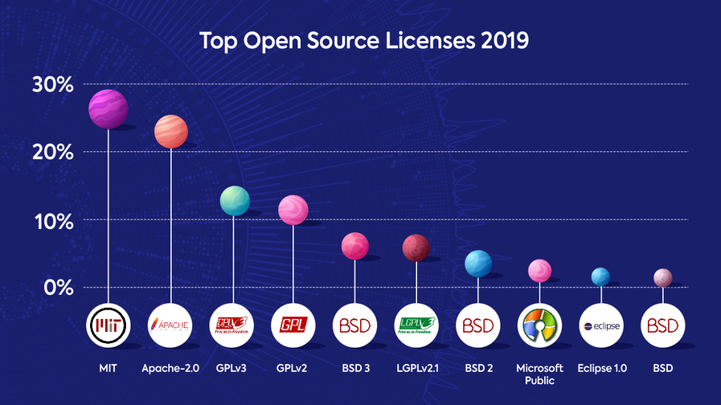

layout: true

.header[
.font-xs.bold.nord8.letter-spacing-60[Free & Open-source software licenses]
]

.footnote[
.font-sm.bold.nord8[sebastien.campion@pm.me
.ri-creative-commons-line.icon-inline.nord8[]
.ri-creative-commons-by-line.icon-inline.nord8[]
.ri-creative-commons-nc-line.icon-inline.nord8[]
.ri-creative-commons-sa-line.icon-inline.nord8[]
]]

---
class: nord-dark, center, middle

background-image: url(img/riccardo-annandale-7e2pe9wjL9M-unsplash3.jpg)

# Free & Open-source software licenses

#### Through different roles involved in software development 
 
<small>.letter-spacing-100[Tetra project]</small>
 
 
 

.letter-spacing-60[DRAFT VERSION]
---

# 📝 Definition 
---------------

> A software license is a legal instrument [...] governing the use or redistribution of software.

.right.font-sm.nord9[Wikipedia]

 
It's tool to manage the software usage. 

> Licenses are tools and different tools serve different purposes.  

 
As a user, this legalese that makes it all work can be kind of confusing
and boring and even intimidating, and sometimes you might think it's pointless

???
It only helps you see why things are the way they are,
but actually gives you new tools, new ways to influence and control
how your software is used, and to help you make sure
it achieves the goals that you set for it.

---

# 👥 Who is concerned ? 
------------------------

 

### Severals roles and point of view when we are talking about licenses
 
#### **Provider** : You create a software and define the license associated
 
#### **Consumer** : You integrate several FOSS components in your developments
 
#### **Contributor** : You send back your contributions to the maintainers
 

---
# 🥅 Goals 
-----------
 
- ### •  Learn the basics of how intellectual property law
 
- ### •  Understand how licenses are built on top of those principles
 
- ### •  Enable you to work effectively with free and open source software in the different roles
---
background-image: url(img/jeshoots-com-9n1USijYJZ4-unsplash2.jpg)

# Overview:
-----
- ### • What is intellectual property ? 

--
- ### • Why we do need license ?

--
- ### • Permissive licenses

--
- ### • Copyleft licenses

--
- ### • Public domain

--
- ### • Customs licenses

--
- ### • Licensing contributions

---

class: nord-dark

background-image: url(img/melinda-gimpel-xcVW_sFp4jQ-unsplash.jpg)

## Disclaimer
-----
###I'M NOT A 

---

# What is Intellectual Property ?
-------
> Intangible "creation of the mind" that lets you monopolize.

--

The categories we'll looking today : 

--

 
-  #### ◦ Copyrights 

--

 
- #### ◦ Patents

--

 
- #### ◦ Trademarks

---

# Copyright ©
--------------

- ### ◦ Protects creative, expressive works
 
- ### ◦ Meant to encourage people make more
 
- ### ◦ Given /automatically/ to the creator
 
- ### ◦ Limited-time offer!
 

---

# 🔏 Moral Rights
--------------

- ### ◦ Non-commercial right related to the copyright 
- ### ◦ Right to attribution, integrity of the work
- ### ◦ Vary a lot from country to country
- ### ◦ Might not be automatic
- ### ◦ Might last forever
- ### ◦ Might not be possible to waive or transfer

> And moral rights are sort of the non-commercial part of copyright.
It's not so much about making money off of your creation.
It's about things like the right to be identified as the author,
or the right to the integrity of the work.
And "integrity" in this context means keeping people from changing
or presenting your work in ways that you don't like,
like putting on a display and defacing your art,
even if they own it.

> And in some countries, you cannot waive, reject,
or give away or sell your moral rights.
It's just not allowed,

---

# 💡 Patents
-------------

- For protecting functional inventions
- The deal: tell us how it works, and you get exclusivity ... for a while 
- Beware of sneaky troll and ambushes !
- Some license protect you 

---

# ® Trademarks ™
--------------

- For protections from fakes and imitators
- Sort of automatic, but registration® has power
- Covers names, logos and identifiers like that
- Still relevant to software projects 

---
class: center, middle
# 📜 Licenses 
---
# Licenses 
--------------

- intellectual property law is a reality whether you like it or not

A license is a set of permissions that you give to someone.

Grant rights people wouldn't usually have:
- To use
- To modify 
- To share 

When you create something like a piece of software,
you alone have the right to it, and you have control
over how to share those rights with others.
And a license is what we use to give people rights
they wouldn't ordinarily have, like the right to use the software,
to modify it, or to copy and share it.

Create obligations:
- Attribution 
- Share-alike (copy left)
- Whatever shows up in a proprietary license

???
The most obvious example is of course proprietary software,
which generally has a license that only gives you the right to use it,
but prohibits you not just from copying and sharing it,
but also from things like reverse engineering it,
or in some cases even from really wild stuff
like benchmarking the performance of the software
and sharing that data.
Some proprietary database licenses have that.

the key idea is that without a license,
no one has any rights to the software, and the license is the thing

 just publishing the source code,
like by throwing it up on GitHub without a license,
that does not give anyone any rights.
That is not code you can use, it's just code

---

## 🙀 419 Licenses listed by the Linux™ Foundation
---------------------------------------------------

This inventory was realize during the specification of the *Software Package Data Exchange* standard.

<iframe width="100%" height="70%" src="https://spdx.org/licenses/" allowfullscreen frameborder=”no” border=”0″ marginwidth=”0″ marginheight=”0″ scrolling=”no” allowtransparency=”yes”></iframe>

---

## 🗄 Main categories
----------------------

.block-middle.width-70[]

---
background-image: url(img/Software_Categories_expanded.svg2.png)
---

# Permissive Licenses
--------------

- Let developers do a lot ... including making things proprietary
- Usually just require attribution ... and a warranty disclaimer 

MIT/Expat/X11, ISC/n-clause BSD ...
Apache 2.0

you can do pretty much whatever with the software.
You can even build proprietary code
on top of the the code that's been shared.
You usually just have to provide attribution,
meaning you have to give credit to the person who wrote it,
and there's often

pick a permissive license like this
when your goal is just for the code to be shared
and used as widely as possible.
You're trying to make life as easy as possible for developers
by making everything available to them for whatever use they want,
even if they don't want to reciprocate
by sharing their improvements back to you.
That's a very pragmatic approach. It's very business-friendly.

---

# 🔓 Apache 2.0 
-----------------

### 🔑 patent-troll-killing  anti-patent-ambush clause.  
 
 

>    ... each Contributor grants [...] You a perpetual, worldwide, non-exclusive, no-charge, royalty-free, 
>    irrevocable [...] patent license to make, have made, use, [...] the Work ...

 
>    ... applies only to those patent claims [...] that are necessarily infringed by their Contribution(s) 

 
>    ... If You institute patent litigation [...] alleging that the Work [...] constitutes 
>    direct or contributory patent infringement, then any patent licenses granted to 
>    You [...] shall terminate 

???

little more verbose than the ones we just looked at --
instead of like three paragraphs, it's more like three pages --
and it has some kind of slightly annoying requirements
about putting notices in files you've changed,
but it also has a really important clause that the other ones don't,
and that is a grant of patent license,
which, going back to what we talked about earlier about patents,
this is the kind of clause that I've said is really great to have

---

#  &copy;  Copyleft  
----------------------------------------------------

- ### ◦ Guarantee user freedom

>Freedom 0 : the freedom to use the work

>Freedom 1 : the freedom to study the work

>Freedom 2 : the freedom to copy and share the work with others

>Freedom 3 : the freedom to modify the work, and the freedom to distribute modified and therefore derivative works

- ### ◦ Prevent developers from restricting or locking-in users 
- ### ◦ Require sharing derivatives the same way 🦠
- ### ◦ Prevent building proprietary software
 
### .center[***GPL, LGPL, AGPL***]

---
background-image: url(img/february11_daffara2.png) 
### Compliance 
-----------
Adapted from David A. Wheeler ([2007](http://www.dwheeler.com/essays/floss-license-slide.html))

---
# 🌍 Public domain 
------------------

I don't care; do whatever! (a.k.a "What about the the Public Domain ?")

- Please do pick a license
- Visible source ≠ Free/Open source
- Public domain
... remember "morals rights" ?

---

background-image: url(img/chris-slupski-eVSwGV-PS2Y-unsplash2.jpg)

# Custom license 
--------------

      
### .center[PLEASE DON'T]

---
class: nord-dark, center, middle
background-image: url(img/isaac-smith-AT77Q0Njnt0-unsplash2.jpg)

# ***Trends***

---
class: nord-dark
### 📊 Top in 2019
---------------------------

.block-middle.width-90[]

.right.font-sm.nord9[Source: whitesourcesoftware]

---
class: nord-dark
### 📈 Trend in 2019
---------------------------

.block-middle.width-90[]

.right.font-sm.nord9[Source: whitesourcesoftware]

---
class: nord-dark
### 📈 Apache 2 popularity
---------------------------

.block-middle.width-90[]

.right.font-sm.nord9[Source: whitesourcesoftware]

---
background-image: url(img/umberto-lhJrm1BRVV0-unsplash2.jpg)

# 📄 Non-Software Licenses
------------------------
Remember, the point of the license is to further your goals - and not-code is
different from code!

- GNU Free Documentation License (GFDL)
- Creative Commons (BY, NC, ND, SA)
.ri-creative-commons-line.icon-inline[]
.ri-creative-commons-by-line.icon-inline[]
.ri-creative-commons-nc-line.icon-inline[]
.ri-creative-commons-sa-line.icon-inline[]

.float-right.width-27.pt-xxs.pl-xs[]

---

# 🤝 Licensing contributions
-----------------------------

- Copyright assignment (don't except for good reason)
- Contributor license agreement (CLA)
(depends entirely on what it says) 
- Developer's Certificate of Origin (DCO)
(really good! minimal hassle!)

---

### 🔬 Software Heritage Confidential Scanner
----------------------------------------------
https://scan.certcode.eu
<iframe width="100%" height="70%" src="https://scan.certcode.eu" allowfullscreen frameborder=”no” border=”0″ marginwidth=”0″ marginheight=”0″ scrolling=”no” allowtransparency=”yes”></iframe>

---

# Conclusions
-------------

Pick a license 
... that is already established and widely use
... that make sense within your community
... that is appropriate to the nature of the work
... and that furthers your goals for the software 

---

##### 🔗 Webography
--------------------
.font-xs.nord9[
Apache License 2.0 https://www.apache.org/licenses/LICENSE-2.0

Copyleft https://en.wikipedia.org/wiki/Copyleft

GNU License - Free Software Foundation https://www.gnu.org/licenses/

Felix Crux What You Need to Know About Open Source Licenses PyCon 2016

License Compatibility https://en.wikipedia.org/wiki/License_compatibility

Open-source license https://en.wikipedia.org/wiki/Open-source_license

The BSD License Problem https://www.gnu.org/licenses/bsd.en.html

Various Licenses and Comments about Them https://www.gnu.org/licenses/license-list.en.html

Open Source Initiative Licenses & Standards https://opensource.org/licenses

Linux Foundation SPDX License List https://spdx.org/licenses/

The Free-Libre / Open Source Software (FLOSS) License Slide http://www.dwheeler.com/essays/floss-license-slide.html

Apple closes down OS X https://www.macworld.co.uk/news/apple-closes-down-os-x-14663/

Theme presentation: https://github.com/1-2-3/remark-it

Software license https://en.wikipedia.org/wiki/Software_license

CC0 incompliant with OSD on patents https://web.archive.org/web/20160312093735/https://lists.opensource.org/pipermail/license-review/2012-March/001679.html

SQLITE Copyright https://sqlite.org/copyright.html

Top Open-Source Licenses https://web.archive.org/web/20160719043600/https://www.blackducksoftware.com/top-open-source-licenses

Which Open Source Licenses Were Trending in 2019? https://resources.whitesourcesoftware.com/blog-whitesource/open-source-licenses-trends-and-predictions
 
 

##### 📷 Credits 
--------------
- ◦ Photo by <a href="https://unsplash.com/@melindagimpel?utm_source=unsplash&amp;utm_medium=referral&amp;utm_content=creditCopyText">Melinda Gimpel</a> on <a href="https://unsplash.com/?utm_source=unsplash&amp;utm_medium=referral&amp;utm_content=creditCopyText">Unsplash</a>
- ◦ Photo by <a href="https://unsplash.com/@pavement_special?utm_source=unsplash&amp;utm_medium=referral&amp;utm_content=creditCopyText">Riccardo Annandale</a> on <a href="https://unsplash.com/?utm_source=unsplash&amp;utm_medium=referral&amp;utm_content=creditCopyText">Unsplash</a>
- ◦ Photo by <a href="https://unsplash.com/@kslupski?utm_source=unsplash&amp;utm_medium=referral&amp;utm_content=creditCopyText">Chris Slupski</a> on <a href="https://unsplash.com/?utm_source=unsplash&amp;utm_medium=referral&amp;utm_content=creditCopyText">Unsplash</a>
- ◦ Photo by <a href="https://unsplash.com/@jeshoots?utm_source=unsplash&amp;utm_medium=referral&amp;utm_content=creditCopyText">JESHOOTS.COM</a> on <a href="https://unsplash.com/s/photos/agenda?utm_source=unsplash&amp;utm_medium=referral&amp;utm_content=creditCopyText">Unsplash</a>
- ◦ Photo by <a href="https://unsplash.com/@umby?utm_source=unsplash&amp;utm_medium=referral&amp;utm_content=creditCopyText">Umberto</a> on <a href="https://unsplash.com/?utm_source=unsplash&amp;utm_medium=referral&amp;utm_content=creditCopyText">Unsplash</a>
- ◦ Photo by <a href="https://unsplash.com/@isaacmsmith?utm_source=unsplash&amp;utm_medium=referral&amp;utm_content=creditCopyText">Isaac Smith</a> on <a href="https://unsplash.com/s/photos/growth-graph?utm_source=unsplash&amp;utm_medium=referral&amp;utm_content=creditCopyText">Unsplash</a>
]

